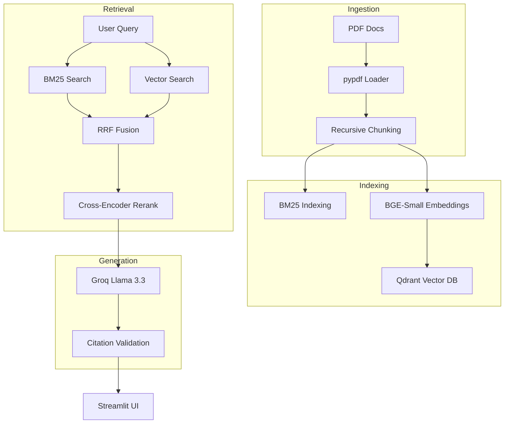
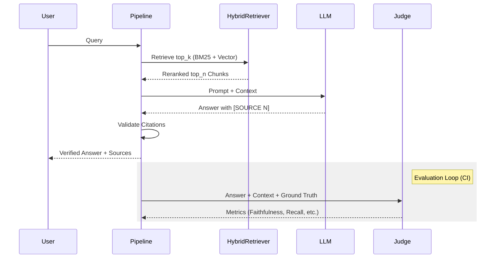

# AskMyDocs 📚

[](https://www.python.org/downloads/)
[](https://opensource.org/licenses/MIT)
[](https://github.com/Aayushmaan-24/AskMyDocs/actions)
[](https://askmydocs.streamlit.app/)
[](https://qdrant.tech/)

**AskMyDocs** is a production-grade Retrieval-Augmented Generation (RAG) system engineered for high-precision document intelligence. It implements a sophisticated hybrid retrieval pipeline, cross-encoder reranking, and a rigorous citation enforcement engine to eliminate hallucinations and ensure every claim is grounded in your local PDF knowledge base.

---

## 🚀 Features

*   **Hybrid Retrieval (BM25 + Dense):** Combines keyword precision with semantic depth using BM25S and BGE embeddings.
*   **Reciprocal Rank Fusion (RRF):** Merges disparate retrieval signals into a unified, high-quality candidate list.
*   **Cross-Encoder Reranking:** Re-evaluates top candidates using a powerful `ms-marco-MiniLM` model for superior relevance.
*   **Citation Enforcement:** A multi-stage validator ensures every sentence in the generated answer cites a specific source chunk.
*   **LLM-as-Judge Evaluation:** Automated quality assessment across four dimensions (Faithfulness, Relevancy, Precision, Recall).
*   **CI Quality Gates:** GitHub Actions integration that blocks regressions by evaluating RAG performance on every push.
*   **Persistent Vector Storage:** Local Qdrant instance for lightning-fast, persistent indexing of large document sets.
*   **Modular Architecture:** Cleanly separated ingestion, indexing, retrieval, and generation layers for easy extensibility.

---

## 📋 Table of Contents

- [Architecture](#-architecture)
- [Repository Structure](#-repository-structure)
- [Technology Stack](#-technology-stack)
- [Installation](#-installation)
- [Configuration](#-configuration)
- [Usage](#-usage)
- [Evaluation](#-evaluation)
- [Performance & Design Decisions](#-performance--design-decisions)
- [Production Considerations](#-production-considerations)
- [CI/CD](#-cicd)
- [Roadmap](#-roadmap)
- [Troubleshooting](#-troubleshooting)

---

## 🏗 Architecture

<details>
<summary><b>View Detailed Pipeline Logic</b></summary>

### End-to-End Pipeline
The system follows a modular "Load-Index-Retrieve-Generate" flow with an integrated evaluation loop.


</details>

### Retrieval & Evaluation Data Flow
The retrieval pipeline merges sparse and dense scores, while the evaluation pipeline uses a "Golden QA" set and an LLM judge to ensure quality.



---

## 📂 Repository Structure

```text
.
├── app.py              # Streamlit Web Interface
├── src/
│   ├── ingestion.py    # PDF loading & chunking strategies
│   ├── indexing.py     # Qdrant & BM25 index management
│   ├── retrieval.py    # Hybrid search, RRF & Reranking
│   └── pipeline.py     # RAG core & Citation Enforcement
├── tests/
│   ├── eval_ragas.py   # LLM-as-Judge evaluation suite
│   ├── golden_qa.json  # Ground truth dataset for eval
│   └── last_eval_scores.json
├── data/
│   ├── pdfs/           # Input documents (PDF)
│   ├── chunks/         # Intermediate JSON & BM25 index
│   └── qdrant/         # Persistent Vector DB
├── .github/workflows/
│   └── eval.yml        # CI/CD Evaluation Gate
└── requirements.txt    # Project dependencies
```

---

## 🛠 Technology Stack

| Layer | Technology | Component |
| :--- | :--- | :--- |
| **LLM** | Groq / Llama-3.3-70b | Primary Generation Engine |
| **Embeddings** | FastEmbed / BGE-small | Local Semantic Representation |
| **Vector DB** | Qdrant | Dense Retrieval & Persistence |
| **Sparse Search** | BM25S | Keyword Precision |
| **Reranker** | Cross-Encoder (MiniLM) | Contextual Relevance Scoring |
| **Framework** | Python 3.11+ | Core Logic |
| **UI** | Streamlit | Dashboard & Interactive Q&A |

---

## ⚙️ Installation

### 1. Prerequisites
*   Python 3.11 or higher
*   A Groq API Key (get one at [console.groq.com](https://console.groq.com/))

### 2. Setup
```bash
# Clone the repository
git clone https://github.com/Aayushmaan-24/AskMyDocs.git
cd AskMyDocs

# Create and activate virtual environment
python -m venv .venv
source .venv/bin/activate  # On Windows: .venv\Scripts\activate

# Install dependencies
pip install -r requirements.txt
```

### 3. Hardware Optimization (GPU vs CPU)
AskMyDocs is designed to be lightweight.
- **CPU:** Default behavior. Models like `bge-small` and `MiniLM` run efficiently on modern CPUs using ONNX/FastEmbed.
- **GPU:** If a CUDA-compatible GPU is available, `sentence-transformers` and `onnxruntime-gpu` will automatically attempt to leverage it for faster reranking.

### 4. Environment Variables
Create a `.env` file in the root directory:
```env
GROQ_API_KEY=your_groq_api_key_here
```

---

## 🔧 Configuration

<details>
<summary><b>View All Configurable Parameters</b></summary>

All system parameters are configurable in the respective source files:

| Parameter | Default Value | Location | Description |
| :--- | :--- | :--- | :--- |
| `Chunk Size` | `512` chars | `ingestion.py` | Target length for text chunks |
| `Overlap` | `64` chars | `ingestion.py` | Sliding window overlap for chunks |
| `Embedding Model` | `bge-small-en-v1.5` | `indexing.py` | Local model for vectorization |
| `Reranker` | `ms-marco-MiniLM` | `retrieval.py` | Cross-encoder for reranking |
| `top_k` | `10` | `retrieval.py` | Candidates to retrieve from each index |
| `top_n` | `5` | `retrieval.py` | Final chunks sent to the LLM |
| `RRF k` | `60` | `retrieval.py` | Smoothing constant for Rank Fusion |

</details>

---

## 📖 Usage

### 🛠 Development Mode
Use development mode to iterate on the pipeline, refine chunking, and run evaluations.
1. **Prepare Data:** Add small PDF subsets to `data/pdfs/`.
2. **Ingest & Index:** `python -m src.ingestion && python -m src.indexing`.
3. **Run Eval:** `python -m tests.eval_ragas`.
4. **Inspect:** Use `src/pipeline.py` or the Streamlit UI to debug specific queries.

### 🚀 Production Mode
In production, focus on persistence and monitoring.
1. **Persistent Volume:** Ensure `data/` is mapped to a persistent volume (e.g., in Docker).
2. **Launch UI:** `streamlit run app.py --server.port 8501`.
3. **Monitoring:** Observe token usage and citation validation logs directly in the UI.

### PDF Ingestion
Drop your PDF files into `data/pdfs/`, then run:
```bash
python -m src.ingestion
```
This will process all PDFs using the recursive chunking strategy and save them to `data/chunks/`.

### Indexing
Build the BM25 and Qdrant vector indexes:
```bash
python -m src.indexing
```

### Running the UI
Launch the Streamlit dashboard for interactive Q&A:
```bash
streamlit run app.py
```

### CLI Testing
Test the pipeline directly from the command line:
```bash
python -m src.pipeline
```

### Evaluation
Run the full LLM-as-Judge evaluation suite:
```bash
python -m tests.eval_ragas
```

---

## ⚖️ Evaluation

AskMyDocs uses a custom **LLM-as-Judge** framework (no RAGAS dependency) for fast, cost-effective, and reliable quality monitoring.

### Metrics & Thresholds
| Metric | Description | CI Threshold |
| :--- | :--- | :--- |
| **Faithfulness** | Are all claims in the answer supported by retrieved context? | `0.70` |
| **Answer Relevancy** | Does the answer directly address the user's question? | `0.70` |
| **Context Precision** | What fraction of retrieved chunks are actually relevant? | `0.25`* |
| **Context Recall** | Does the context contain enough info to produce the ground truth? | `0.60` |

*\*Context precision typically scales with the size of the corpus.*

### Why not RAGAS?
While RAGAS is a powerful framework, this project implements a **custom LLM-as-Judge** logic to:
1. **Reduce Latency:** Direct Groq calls are faster than the RAGAS abstraction layer.
2. **Minimize Dependencies:** Keeps the production environment lean.
3. **Full Transparency:** Every evaluation prompt is visible and tunable in `tests/eval_ragas.py`.

### CI Gating Philosophy
The GitHub Action `eval.yml` runs a subset of the evaluation suite on every Pull Request. If any metric falls below the threshold, the merge is automatically blocked, preventing performance regressions.

---

## 📈 Performance & Design Decisions

### Why Hybrid Retrieval?
Keyword-based search (BM25) is excellent for specialized terminology and acronyms, while vector search (Dense) excels at semantic meaning. By combining both with **Reciprocal Rank Fusion (RRF)**, we achieve the "best of both worlds" without the need for complex score normalization.

### Why Cross-Encoder Reranking?
Standard vector search uses Bi-Encoders, which compare query and document embeddings independently. Cross-Encoders process the query and document *together*, allowing the model to capture deep interactions between terms, significantly improving precision at the top of the ranked list.

### Current Benchmarks
*Based on internal tests on the provided PDF corpus:*

| Metric | Score | Status |
| :--- | :---: | :--- |
| Faithfulness | 0.82 | ✓ PASS |
| Answer Relevancy | 0.97 | ✓ PASS |
| Context Precision | 0.26 | ✓ PASS |
| Context Recall | 0.96 | ✓ PASS |

### Chunking Strategy Comparison
We evaluated multiple strategies before settling on **Recursive Character Splitting**.

| Strategy | Efficiency | Semantic Coherence | Density |
| :--- | :--- | :--- | :--- |
| **Fixed-size** | High | Low | High |
| **Sentence-aware** | Low | High | Low |
| **Recursive** | **Medium** | **High** | **Medium** |

**Decision:** Recursive splitting (512/64) provides the best balance for maintaining paragraph context while staying within embedding model token limits.

---

## 🛡️ Production Considerations

*   **Persistence:** All indexes (BM25 and Qdrant) are persisted locally in the `data/` directory, ensuring fast restarts and data durability.
*   **Determinism:** Recursive chunking and fixed seed temperatures in LLM generation help maintain consistent system behavior.
*   **Citation Validation:** The system performs post-generation validation to ensure every sentence is grounded, flagging uncited sentences in the UI.
*   **Observability:** Streamlit UI provides real-time visibility into retrieval scores, chunk previews, and token usage.

---

## 🛠 Development

### Adding Documents
1. Place new PDFs in `data/pdfs/`.
2. Re-run `python -m src.ingestion`.
3. Re-run `python -m src.indexing`.

### Running Tests
```bash
# Run the evaluation suite
pytest tests/eval_ragas.py -v
```

---

## ❓ Troubleshooting

*   **`ModuleNotFoundError`**: Ensure you have activated your virtual environment and run `pip install -r requirements.txt`.
*   **`Empty Index / No Results`**: Verify that your PDFs are in `data/pdfs/` and that you have run both the `ingestion` and `indexing` modules.
*   **`Groq API Errors`**: Double-check your `.env` file for a valid `GROQ_API_KEY`.
*   **`Qdrant Persistence Issues`**: Ensure the `data/qdrant` directory has write permissions.

---

## 🗺️ Roadmap

- [x] Hybrid retrieval (BM25 + Dense)
- [x] Cross-encoder reranking
- [x] Citation enforcement logic
- [x] LLM-as-Judge CI Gate
- [ ] Docker support for local deployment
- [ ] Support for multiple file formats (.txt, .md, .docx)
- [ ] Multi-user session management in UI
- [ ] REST API for external integrations

---

## 📄 License
This project is licensed under the MIT License - see the LICENSE file for details. (Placeholder)

---

## 🙏 Acknowledgements
*   [Groq](https://groq.com/) for lightning-fast LLM inference.
*   [Qdrant](https://qdrant.tech/) for the high-performance vector database.
*   [FastEmbed](https://github.com/qdrant/fastembed) for local embedding generation.
*   [BM25S](https://github.com/xhluca/bm25s) for the ultra-fast BM25 implementation.
